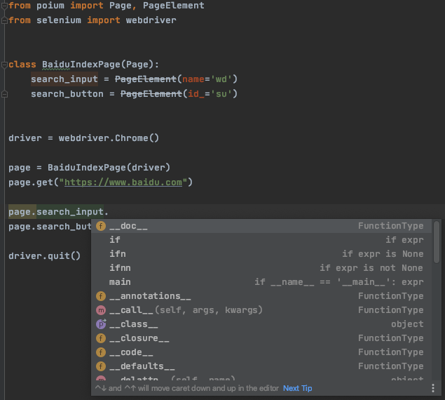
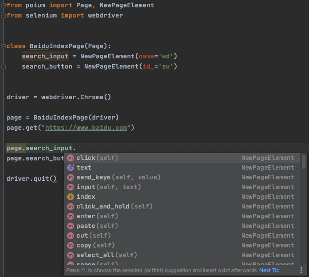

# 0.6.0 版本主要变动

## PageElement 和 PageElements

在 poium `0.6.0` 版本之前 提供了 `PageElement` 和 `PageElements`两个类，分别定位单个元素和一组元素。

用法：

```py
from poium import Page, PageElement, PageElements

class BaiduPage(Page):
    # 定位单个元素
    search_input = PageElement(id_='kw')
    search_button = PageElement(id_='su')
    # 定位一组元素
    search_result = PageElements(xpath="//div/h3/a")
```

但是，使用时并不知道元素对象提供了那些操作，例如`click()`、`send_keys()`、`text`...等，更重要的是无法通过编辑器(pycharm)联想，如何你们不熟悉Selenium/appium API就蒙圈了。



## NewPageElement

在 poium `0.6.0` 版本，为了保持向下的兼容性，重新实现了`NewPageElement`类，最大的区别是在poium重新实现了Selenium/appium的元素对象操作方法。



现在，可以对元素对象对做什么操作是不是一目了然。

## NewPageElement的用法

`NewPageElement`类提供了几个参数，用法非常简单。

用法：

```py
from poium import Page, NewPageElement


class BaiduIndexPage(Page):
    search_input = NewPageElement(name='wd', index=0, describe="百度输入框", timeout=5)
    search_button = NewPageElement(id_='su', index=0, describe="百度搜索按钮", timeout=5)

```

* 定位方法

第一个参数是定位方法，支持的定位方法

```py
# selenium
css = "xx"
id_ = "xx"
name = "xx"
xpath = "xx"
link_text = "xx"
partial_link_text = "xx"
tag = "xx"
class_name = "xx"

# appium
ios_uiautomation = "xx"
ios_predicate = "xx"
ios_class_chain = "xx"
android_uiautomator = "xx"
android_viewtag = "xx"
android_data_matcher = "xx"
android_view_matcher = "xx"
windows_uiautomation = "xx"
accessibility_id = "xx"
image = "xx"
custom = "xx"
```

* index指定元素索引

当你的定位方式查找出来是多个元素时，可以通过`index` 指定元素是第几个，默认第一个 `0`。 所以，不在需要`PageElements`类了。

* describe 元素描述

建议为你的每个元素增加描述，当你的页面元素很多的情况下，增加可读性。

* timeout 元素等待时间

针对每个定位的元素设置等待时间，默认为`5`秒，所以，你根本不需要再使用`PageWait`类了。
